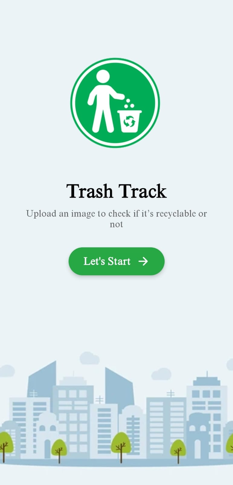
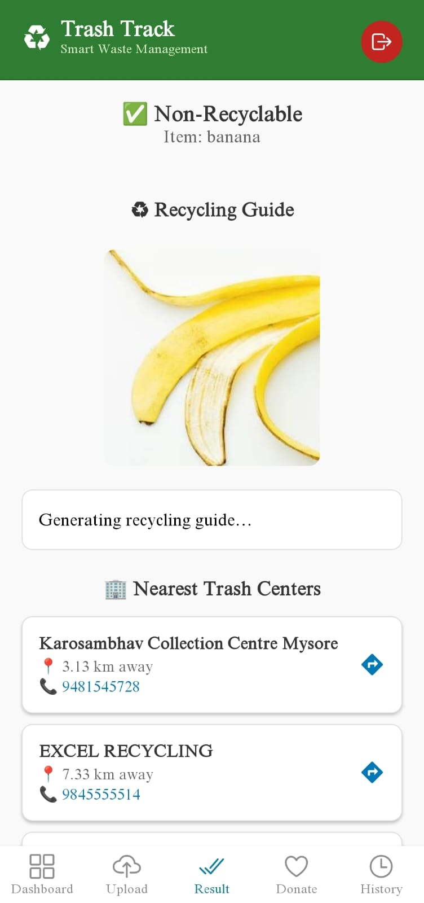
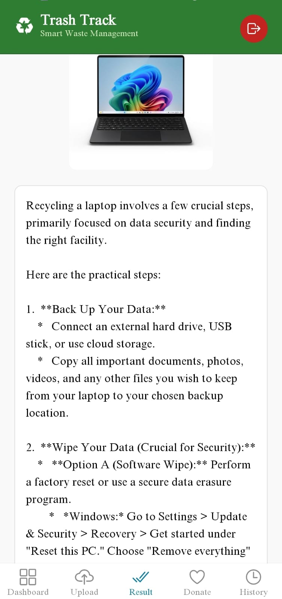
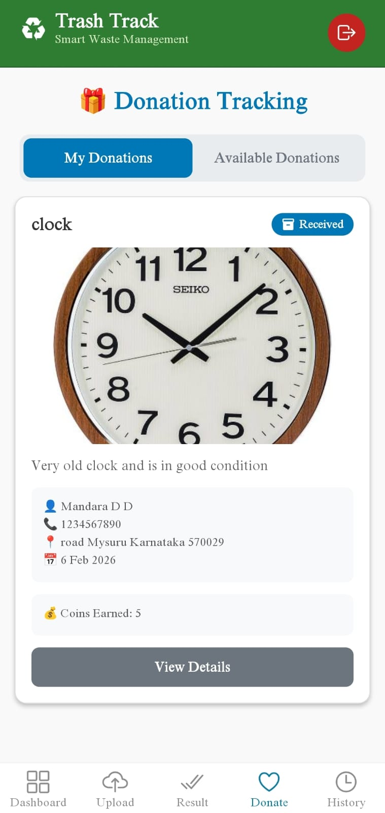
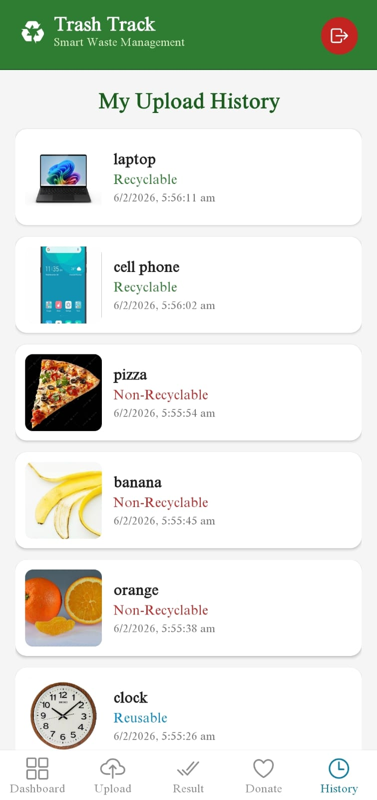
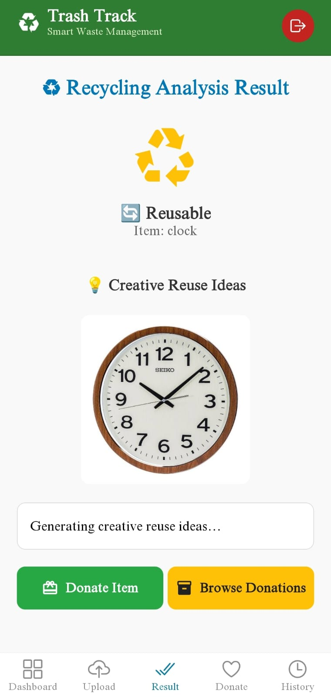
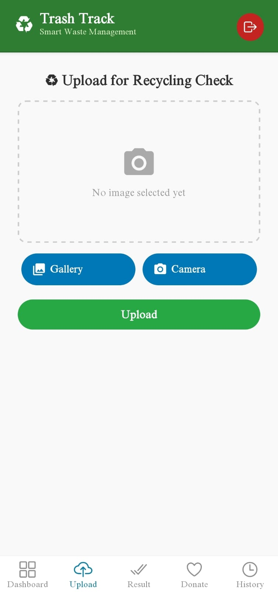
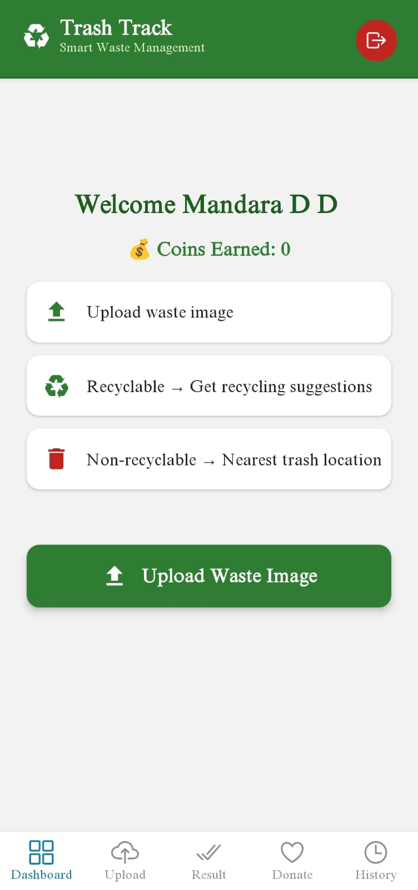
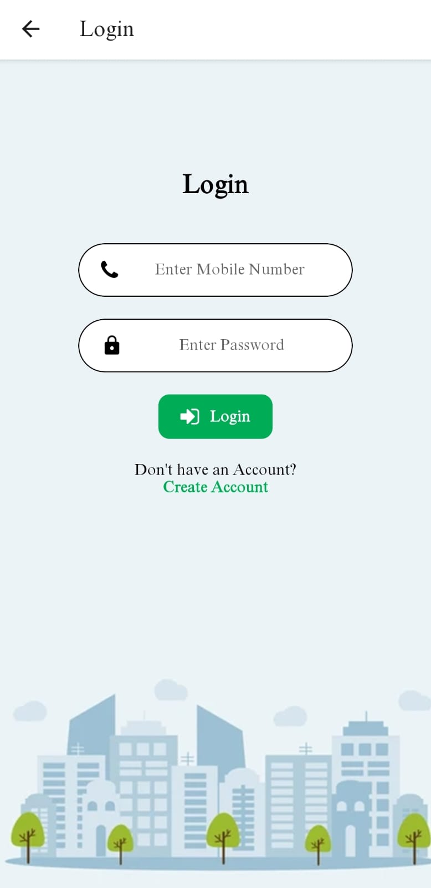
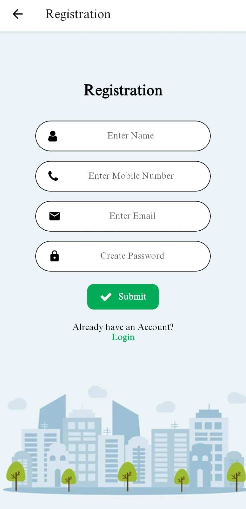

# TrashTrack AI ♻️

**AI-Powered Waste Classification and Recycling Assistance Platform**

TrashTrack AI is a smart waste management platform that uses **computer vision and AI** to identify waste items and provide appropriate recycling guidance. The system combines a mobile application, web-based administration portal, and Python-based AI processing service.

## 🚀 Overview

TrashTrack AI helps users identify waste by uploading an image through the mobile application. The image is processed using a **YOLOv8-based computer vision model**, classified into an appropriate waste category, and stored for further tracking.

The platform also provides recycling-center recommendations and an administrative interface for managing recycling-center information.

## ✨ Features

### 📱 Mobile Application

* User registration and login
* Waste image upload
* AI-based waste classification
* Recycling guidance
* Recycling-center recommendations
* Location-based functionality
* Waste classification history
* Donation tracking

### 🤖 AI Waste Classification

* YOLOv8 object detection
* Image-based waste detection
* Confidence-based classification
* Waste categorization into:
  * Reusable
  * Recyclable
  * Non-Recyclable
* OpenCV-based image processing
* Automatic database status updates

### 🖥️ Admin Web Portal

* Admin login
* Trash/recycling-center management
* Add recycling centers
* Edit recycling-center details
* Delete recycling centers
* Manage center location information

## 🏗️ System Architecture

'
                    ┌──────────────────────┐
                    │   React Native App   │
                    │      Mobile App      │
                    └──────────┬───────────┘
                               │
                         Image Upload
                               │
                               ▼
                    ┌──────────────────────┐
                    │     MySQL Database   │
                    │  Upload / User Data  │
                    └──────────┬───────────┘
                               │
                        Processing Queue
                               │
                               ▼
                    ┌──────────────────────┐
                    │   Python AI Service  │
                    │       YOLOv8         │
                    │ OpenCV + Ultralytics │
                    └──────────┬───────────┘
                               │
                       Classification
                               │
             ┌─────────────────┼─────────────────┐
             ▼                 ▼                 ▼
        Reusable          Recyclable       Non-Recyclable
             │                 │                 │
             └─────────────────┼─────────────────┘
                               ▼
                    ┌──────────────────────┐
                    │   React Admin Web    │
                    │  Recycling Centers   │
                    └──────────────────────┘
`

## 🛠️ Technologies Used

### Mobile

* React Native
* Expo
* Expo Router
* TypeScript
* Axios
* Expo Image Picker
* Expo Location

### Web

* React.js
* React Router
* React Bootstrap
* Axios
* Bootstrap

### AI / Computer Vision

* Python
* YOLOv8
* Ultralytics
* OpenCV
* NumPy
* Pillow

### Backend / Database

* MySQL
* PyMySQL
* REST API integration

### Development Tools

* Git
* GitHub
* VS Code
* npm

## 📂 Project Structure

``
TrashTrack/
│
├── mobile-app/
│   ├── app/
│   │   ├── (tabs)/
│   │   ├── (user)/
│   │   ├── Login.tsx
│   │   ├── Registration.tsx
│   │   └── Upload.tsx
│   ├── components/
│   ├── assets/
│   ├── package.json
│   └── app.json
│
├── web-admin/
│   ├── src/
│   │   ├── Component/
│   │   │   ├── Home.js
│   │   │   ├── Login.js
│   │   │   ├── AdminDashboard.js
│   │   │   └── Addcenter.js
│   │   └── App.js
│   └── package.json
│
├── ai-service/
│   ├── Identify.py
│   ├── yolov8n.pt
│   └── requirements.txt
│
└── README.md
`

## 🔄 How It Works

1. The user registers or logs into the mobile application.
2. The user uploads an image of a waste item.
3. The image is stored and marked for processing.
4. The Python AI service retrieves the pending image.
5. YOLOv8 detects the object in the image.
6. The detected object and confidence score are evaluated.
7. The object is mapped to a waste category.
8. The classification status is updated in the database.
9. The result is displayed to the user.
10. Users can view their classification history and recycling information.

## 🧠 Waste Classification

The AI service maps detected objects into three categories:

| Category       | Description                                 |
| -------------- | ------------------------------------------- |
| Reusable       | Items that may be reused                    |
| Recyclable     | Items suitable for recycling                |
| Non-Recyclable | Items that are not classified as recyclable |

The system also applies a confidence threshold when determining whether a detected object should receive a classification.

## 🖼️ Screenshots
<p align="center">
  
  
  
  
</p>

<p align="center">
  
  
  
  
</p>

<p align="center">
  
  
</p>


## ⚙️ Installation

### AI Service

``bash
git clone <your-repository-url>
cd ai-service
``

Create a virtual environment:

``bash
python -m venv venv
``

Activate it on Windows:

```bash
venv\Scripts\activate
```

Install dependencies:

```bash
pip install -r requirements.txt
```

Run the service:

```bash
python Identify.py
```

### Mobile Application

```bash
cd mobile-app
npm install
npx expo start
```

### Web Admin

```bash
cd web-admin
npm install
npm start
```

## 🔐 Environment Configuration

Do not store database passwords, API keys, or other secrets directly in source code.

Create an environment configuration file such as:

```text
DB_HOST=
DB_USER=
DB_PASSWORD=
DB_NAME=
```

Add `.env` to `.gitignore`.

## 📌 Future Improvements

* Improve waste classification accuracy
* Add a larger custom-trained waste dataset
* Add more waste categories
* Add real-time camera-based classification
* Improve recycling-center recommendations
* Add analytics for waste classification
* Deploy the AI service to a cloud environment
* Add automated model performance monitoring


